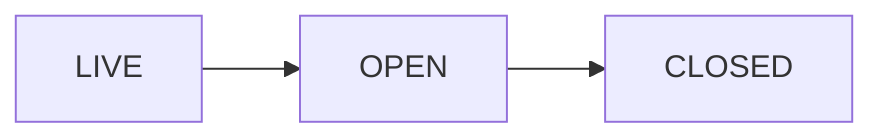

# The Operators — user flows for Candidates and full Operators

This document describes **what people actually do** in the system: step-by-step journeys for **Candidates** (applicants on the path to membership) and **approved Operators** (full members). It matches how the app is built today ([src/pages/operators/](../src/pages/operators/), [api/operators/](../api/operators/), [lib/operators/permissions.js](../lib/operators/permissions.js)).

For a technical map of routes and APIs, see [OPERATORS_PLATFORM_FUNCTIONS_SUMMARY.md](./OPERATORS_PLATFORM_FUNCTIONS_SUMMARY.md).

---

## How everyone gets in (shared gate)

1. **Membership is invite-only.** An email must exist in Supabase **`operators_users`** before the magic-link flow can complete.
2. **Super admins or scripts** can insert a row (see [database/operators_setup_user.sql](../database/operators_setup_user.sql)).
3. **Candidate pipeline:** When an Operator submits a candidate application for an event, the system **creates or updates** `operators_users` for that email (typically with the **`candidate`** role) so they can receive a magic link afterward.
4. User opens **`/operators/login`**, enters email, receives link, clicks it → **`/operators/dashboard`** (session uses stored email / URL patterns as implemented).

If someone has **no** row in `operators_users`, they will not get a working magic link (by design).

---

## Event states (shared timeline)

Events move through three states. What you can do depends on **state** and **role**.

| State | Meaning (plain language) |
| --- | --- |
| **LIVE** | Event is published: RSVPs open (until RSVP is closed), prep topics/scenarios, Chief Operator can invite **candidate applications** for this event. |
| **OPEN** | Event night: check-in, voting on attendees, scenarios locked down. |
| **CLOSED** | Wrapped: ROI outcome recorded, attendance finalized, promotions processed when configured. |

Chief Operators / Accountants can also **start**, **close**, **reopen**, or **revert** events using controls on the event page (see event detail).

---

## Journey A — Candidate (applicant)

**Who:** Someone with the **`candidate`** role (and usually **not** yet **`operator`**).

### A1 — Entering the pipeline (you do not sign yourself up from the public site alone)

Typical entry:

1. An **Operator** submits you on a **LIVE** event using **Invite Candidate** on [Event detail](../src/pages/operators/EventDetail.jsx): your email, essay (200+ words), contact info, optional bio fields.
2. API **`POST /api/operators/candidates/submit`** creates a **pending** row in `operators_candidates` and ensures **`operators_users`** exists for your email with at least the **`candidate`** role.

You can also be **pre-created** in `operators_users` by an admin before any application.

### A2 — Chief Operator / Super Admin approval

1. A **Chief Operator** or **Super Admin** reviews submissions on **`/operators/candidates`** (global list) or on the **event page** where applications are listed.
2. **Approve** → status becomes **approved**; your profile fields may be copied from the application; your user row stays **`candidate`** until promotion rules say otherwise.
3. **Deny** → status **denied** (that application ends for this event).

### A3 — Day-to-day use before promotion

Once you can log in:

| Area | What you do |
| --- | --- |
| **Dashboard** [`/operators/dashboard`](../src/pages/operators/Dashboard.jsx) | See aggregate metrics and upcoming LIVE events; RSVP when eligible. |
| **Events** [`/operators/events`](../src/pages/operators/Events.jsx) | Browse/filter events; open an event. |
| **Event detail** | While **LIVE**: **RSVP** (or join waitlist). Read event info and scenarios when shown. You **cannot** submit **Invite Candidate** (Operators only). |
| **Profile** [`/operators/profile`](../src/pages/operators/Profile.jsx) | Update your profile / headshot as the UI allows. |

**During OPEN (event night):**

- **Accountant** checks you in if you RSVP’d (cash / attendance rules as run that night).
- **Voting:** The **event screen only shows the voting controls to users who have the `operator` role** in the UI. The permission layer elsewhere includes candidates for voting in code paths; day-to-day expectation for **Candidates** is **participate as a guest**: attend, be visible to others for **receiving** votes as the agenda defines—not operating the voting UI as a full member.

### A4 — Becoming a full Operator (“promoted”)

Promotion is **not** only “Chief clicked approve.” Full **`operator`** role is intended to attach when the community process completes—often tied to **closing** an **OPEN** event:

1. For **approved** candidates tied to that event, **`POST .../close`** resolves **`operators_promotions`** (yes/no style votes recorded for that candidate).
2. If promoted: **`operator`** is added to your roles in `operators_users`; candidate row may move to status **promoted**.

If promotion rows are missing in the database, that automation may not fire—operations should confirm data exists for your events.

After promotion, follow **Journey B** below.

---

## Journey B — Approved Operator (full member)

**Who:** Someone with the **`operator`** role (often also holds other roles).

### B1 — Ongoing membership

| Area | What you do |
| --- | --- |
| **Dashboard** | Same as candidates: metrics + upcoming LIVE events; quick links. |
| **Events** | Find events; see LIVE / OPEN / CLOSED. |
| **Event detail — LIVE** | **RSVP** or cancel (cancel rules such as time-before-event as enforced in API/UI). **Invite Candidate** for this event (essay + contact). Waitlist behavior if full. |
| **Event detail — OPEN** | Use **up to 10 votes** per event on other attendees (UI shows remaining votes). No voting for yourself. |
| **Profile** | Keep bio/headshot current (used for scenarios and the room). |

### B2 — Event night (OPEN)

1. **Accountant** (or privileged role) **checks you in** when you arrive.
2. You **vote** (up/down) on checked-in peers until you use your vote budget.
3. Chief Operator / Accountant **closes** the event when the night is done.

### B3 — After the event (CLOSED)

- See **ROI / winner** and outcomes on the event when the app displays them.
- **Card / offense / bench** rules apply if your behavior triggered them (Accountants record offenses; Super Admin can reverse in **Admin**).
- **Loyalty** and attendance counters update when eligibility checks pass (server-side on close).

---

## Side paths (who does “staff” work?)

These are not separate “journeys” but **overlays** on the same events:

| Role | Extra responsibilities |
| --- | --- |
| **Chief Operator** | Create/edit events, move states (start/close/reopen), approve/deny candidates, announce, manage waitlist removal, scenarios/topics as built. |
| **Accountant** | Check-in, no-show, checkout, record offenses; **cannot** RSVP via the same permission path as Operators/Candidates (`rsvp` on LIVE is **operator or candidate only**). |
| **Super Admin** | Everything Chief Operator can do for approvals plus **`/operators/admin`**: promote Chief Operators, reverse offenses, user list. |

---

## Quick comparison

| Step | Candidate | Full Operator |
| --- | --- | --- |
| Must exist in `operators_users` | Yes (via invite/application or admin) | Yes |
| Magic link login | Yes | Yes |
| RSVP to LIVE events | Yes | Yes |
| Invite new candidates on an event | No | Yes |
| Voting UI on OPEN events | Not shown (Operator-only UI) | Yes (10 votes) |
| Eligible for ROI / promotion rules | Per event close logic | Yes as peer |

---

## If something feels wrong

- **“Account not found” after magic link:** Email not in `operators_users`, or typo. Fix membership first.
- **Candidate stuck:** Check `operators_candidates` status and whether a **Chief Operator / Super Admin** approved.
- **Promotion didn’t happen:** Confirm **`operators_promotions`** data and that **close event** ran after OPEN.

---

*This flow doc reflects the codebase behavior; business rules in your community may add norms on top (who gets invited first, how promotion votes are collected, etc.).*
